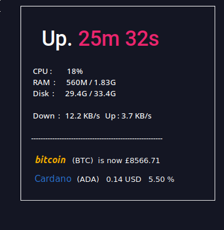

# ada-btc-conky
System Info and Bitcoin and Cardano Price widget for Linux using Conky

will require 'curl' and 'jq' to be installed.

Bitcoin Price defaults to GBP. For USD change txt line to 'currency=USD'
(using Coinbase api).
Cardano Price is in USD
(using HitBTC api).

